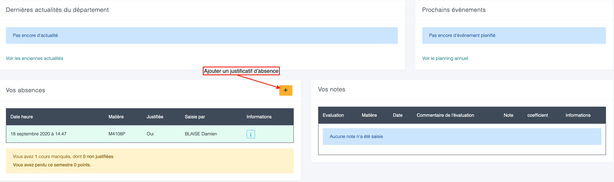
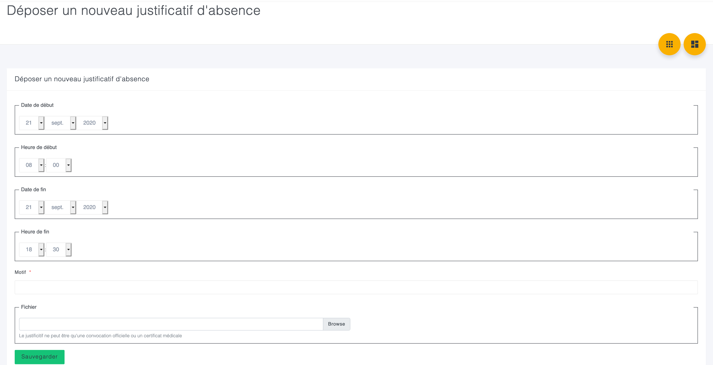
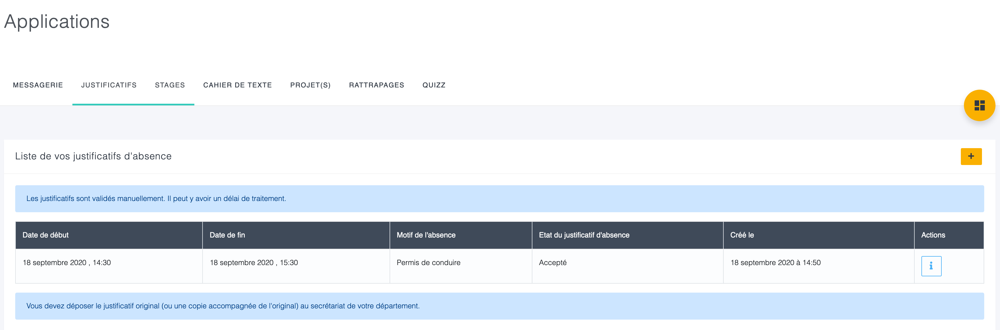

{}
Sur cette version de l'intranet vous pouvez justifier vos absences en ligne.
{}

Pour cela, sur le bloc "vos absences" sur le dashboard vous pouvez ajouter un justification en cliquant sur le "+".

Vous accédez à un formulaire à compléter :

{}
La pièce jointe n'est pas obligatoire, mais vivement recommandée pour attester de votre motif.
La pièce jointe doit être conservée car elle peut être demandée par le département. Des règles particulières peuvent
s'appliquer en fonction de votre formation.
{}

Vous pouvez aussi ajouter ou voir l'état de vos justifications depuis "Applications", onglet "Justificatifs"

Dans cette partie vous avez les justificatifs déposés et leur état de traitement. La validation est manuelle et peut
prendre un peu de temps.

